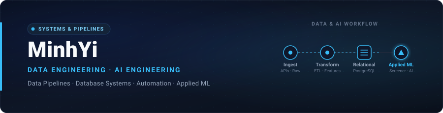

  

  <strong>Building reliable data pipelines, automated workflows, and practical AI systems.</strong> 
  MIS student from Vietnam — interested in how solid data engineering turns raw models into dependable systems.

  
  
  
  
  
  

---

### 🔨 Featured Builds

| Project | Focus | Stack |
| :--- | :--- | :--- |
| [**banking-risk-screener**](https://github.com/minhhyiii-dot/banking-risk-screener) | Vietnamese banking risk · raw data → feature pipeline → ML baseline | `Python` `Pandas` `ML` |
| [**sql-analyst-bootcamp**](https://github.com/minhhyiii-dot/sql-analyst-bootcamp) | 42-day structured SQL journey modeling transactional edge cases & data logic | `SQL` `PostgreSQL` |
| [**python-bootcamp**](https://github.com/minhhyiii-dot/python-bootcamp) | 84-day problem-solving roadmap focused on engineering & coding independence | `Python` `Algorithms` |

---

### ⚡ Activity

  
  

---

### 📬 Connect

  

<!-- To add more contact links when ready:

  
  

-->
